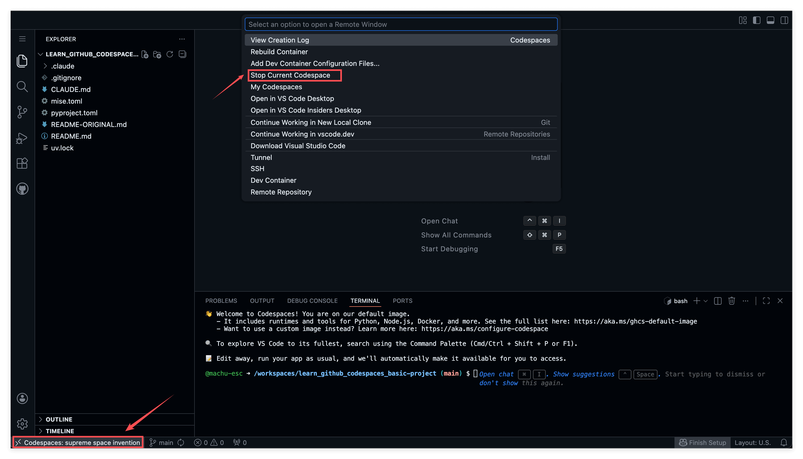

# GitHub Codespaces 入门: 认识云端开发环境

## 1. 概览

配置开发环境, 是初学者遇到的最大障碍之一. 不同操作系统, 互相冲突的软件版本, 缺失的 PATH 配置, 这些问题足以让你在写下第一行代码之前就耗掉好几天. 云端开发环境的出现, 就是为了解决这个问题: 它在浏览器里给你一个随开随用, 配置一致的开发环境.

## 2. 学习目标

想象一下这个场景: 你刚开始学编程, 兴冲冲地想跟着教程写第一行代码. 教程说, 第一步, 安装 Python. 听起来很简单对吧? 但实际上: 你下载了一个版本, 发现是 32 位的, 你的电脑是 64 位; 安装时忘了勾选 Add to PATH, 命令行找不到 Python; 好不容易装好了, 又发现和电脑上已有的版本冲突了; 你去网上搜解决方案, 发现 10 个教程有 10 种不同的说法. 一周过去了, 你还没写出第一行代码.

这不是你的问题, 是配置环境这件事本身就很难. 云端开发环境, 就是为了让你绕过这个大坑而存在的.

学完这个 mini task 你将能够:

1. 说明云端开发环境是什么, 以及它为什么能帮初学者绕开配置环境的坑
2. 说清 GitHub Codespaces 的基本概念和每月免费额度规则
3. 亲手完成一次启动, 使用, 停止和删除 codespace 的完整流程
4. 区分 stop (停止) 和 delete (删除) 一个 codespace 分别意味着什么

## 3. 前置知识

- 一个 GitHub 账号 (免费版即可)
- 一个网页浏览器
- 基本的复制粘贴和点击操作能力

## 4. 你将构建或学到什么

这一课不会让你搭建任何应用. 相反, 你会通过创建, 使用, 管理你的第一个 codespace, 获得对云端开发环境的直接体验. 这项基础技能, 会让你之后所有的学习项目都更顺畅.

---

## 5. 云端开发环境是什么

**传统方式:** 在你自己的电脑上安装所有开发工具.

问题在于, 每个人的电脑都不一样, 操作系统不同, 已安装的软件不同, 系统设置不同. 这就导致 "在我电脑上能跑, 在你电脑上就不行" 的情况经常发生.

**云端方式:** 开发环境运行在远程服务器上, 你通过浏览器访问.

好处是, 不管你用的是什么电脑, 不管电脑配置如何, 只要能打开浏览器, 就能拥有一个完全一致, 已经配置好的开发环境.

### GitHub Codespaces 是什么

GitHub Codespaces 是 GitHub 提供的云端开发环境服务. 简单来说:

- 它在 GitHub 的服务器上为你创建一台虚拟电脑
- 这台虚拟电脑上已经预装了常用的开发工具
- 你通过浏览器就能访问它, 就像使用一个网页应用一样
- 你的代码和文件都保存在云端, 随时可以继续上次的工作

### 免费额度

GitHub 为每个用户提供免费的 Codespaces 使用时长:

- **每月 60 小时免费** (对学习来说完全够用)
- **只有运行时才计费** (停止的 codespace 不消耗额度)
- **30 分钟无操作自动停止** (防止忘记关闭浪费额度)

---

## 6. 云端开发环境的三大好处

### 好处一: 环境一致, 不怕配错

所有人的 codespace 环境完全一样. 这意味着:

- 你遇到问题时, 别人能准确地帮你, 因为环境一致
- 教程上的步骤, 在你的环境里一定能复现
- 不会出现 "为什么我的不行" 的困惑

### 好处二: 隔离风险, 保护电脑

当你想尝试一个新工具, 新框架, 或者运行一段不太确定的代码时:

- **在自己电脑上:** 如果搞砸了, 可能会污染你的系统环境, 卸载都卸不干净
- **在云端环境:** 随便折腾, 搞砸了删掉重建就行, 你的电脑不受任何影响

这对于学习来说特别重要, 你可以大胆尝试, 不怕犯错.

### 好处三: 尝试不信任的东西更安全

如果你想试用一个不太知名的软件, 一段来历不明的代码:

- **在自己电脑上:** 有安全风险, 万一是恶意软件呢?
- **在云端环境:** 即使有问题, 也不会影响你的个人电脑和数据

云端环境就像一个沙盒, 一个隔离的, 安全的实验空间.

---

## 7. 不只是 GitHub

虽然这个课程使用 GitHub Codespaces, 但你应该知道, 云端开发环境有很多平台:

- **GitHub Codespaces:** 我们使用的, 对个人开发者非常慷慨
- **Gitpod:** 另一个流行的云端开发平台
- **Replit:** 特别适合快速实验和分享代码
- **CodeSandbox:** 主要用于前端开发
- **Google Cloud Shell:** Google 提供的云端终端
- **AWS Cloud9:** Amazon 的云端 IDE

GitHub Codespaces 之所以被选中, 是因为它和 GitHub 深度集成, 而且对个人用户的免费额度非常慷慨. 但云端开发的理念是通用的, 学会了这个思维方式, 你可以在任何平台上应用.

---

## 8. 练习: 启动, 使用与清理你的第一个 codespace

现在让我们动手体验一下 codespace 的基本操作. 这个练习很简单, 只需要会点鼠标, 复制粘贴就能完成.

### 步骤 1: 启动 codespace

**目标:** 启动一个 codespace, 看到运行在云端的 VS Code 界面.

**怎么做:**

1. 登录 GitHub, 进入你的任意一个 repository (仓库) 页面
2. 在页面右上方, 文件列表上方, 找到绿色的 **Code** 按钮, 点击它
3. 在弹出的下拉菜单中, 你会看到两个标签: **Local** 和 **Codespaces**. 点击 **Codespaces** 标签
4. 点击绿色按钮 **Create codespace on main**
5. 等待 30 秒到 2 分钟, codespace 会自动启动


**你会观察到:** 启动完成后, 你会看到一个类似代码编辑器的界面, 这就是 VS Code 的网页版, 运行在云端. 界面下方有一个黑色区域, 这就是 **Terminal** (终端).

**关键洞见:** 你现在拥有了一个完整配置好的开发环境, 而你的电脑上什么都没安装.

### 步骤 2: 在终端执行命令

**目标:** 通过执行简单命令, 验证你的云端环境能正常工作.

**怎么做:**

1. 在终端里输入以下命令并按回车:

```
echo "Hello World"
```

你应该会看到终端输出 `Hello World`. 这证明你的云端环境可以正常工作.

2. 接下来, 输入这个命令创建一个文件:

```
echo "This is a message" >> ~/message.txt
```

这个命令会创建一个叫 `message.txt` 的文件, 里面写着 `This is a message`.

3. 验证文件创建成功:

```
cat ~/message.txt
```

你应该会看到输出 `This is a message`.

**关键洞见:** 命令的执行方式和在本地电脑上完全一样, 云端环境的行为就像一台普通电脑.

### 步骤 3: 停止 codespace, 保留数据

**目标:** 学会在保留工作内容的前提下, 暂停一个 codespace.

**怎么做:**

1. 点击浏览器左下角显示的 **Codespaces: xxx** 字样 (xxx 是一个随机生成的名字, 比如 "crispy broccoli")
2. 在弹出的菜单中选择 **Stop Current Codespace**



**替代方式:** 访问 [github.com/codespaces](https://github.com/codespaces), 找到你的 codespace, 点击右侧的 **...** 按钮, 选择 **Stop codespace**.

**关键洞见:** 停止一个 codespace, 就像让电脑进入睡眠状态, 工作内容被保留, 但你不再消耗额度.

### 步骤 4: 重启并验证数据还在

**目标:** 确认停止一个 codespace 不会丢失数据.

**怎么做:**

1. 访问 [github.com/codespaces](https://github.com/codespaces)
2. 找到你刚才停止的 codespace (显示 Stopped 状态), 点击它的名字
3. 等待几秒钟, codespace 恢复运行
4. 在终端输入:

```
cat ~/message.txt
```

你应该仍然能看到 `This is a message`.

**你会观察到:** 文件在停止和重启之间原样保留. **停止 codespace 不会丢失你的数据.**

**关键洞见:** 被停止的 codespace 保留了你的一切工作, 文件, 已安装的软件包, 一样都不少. 只有删除 codespace 才会真正丢失工作内容.

### 步骤 5: 删除 codespace, 彻底清除

**目标:** 学会永久移除一个 codespace.

**怎么做:**

1. 访问 [github.com/codespaces](https://github.com/codespaces)
2. 找到你的 codespace, 点击右侧的 **...** 按钮
3. 选择 **Delete**, 确认删除

删除后, 这个 codespace 就彻底消失了. 如果你再创建一个新的, 之前的 `message.txt` 不会存在.

**关键洞见:** 删除掉不再需要的 codespace, 能让你的工作区保持干净, 避免堆积.

---

## 9. 回顾: 停止与删除的区别

| 操作 | 数据 | 额度消耗 | 适用场景 |
| :--- | :--- | :--- | :--- |
| **Stop (停止)** | 保留 | 停止计费 | 暂时休息, 稍后继续 |
| **Delete (删除)** | 清除 | 不再占用 | 不再需要这个环境 |

简单记忆法:

- **Stop** = 关电脑 (数据还在硬盘里)
- **Delete** = 把电脑扔掉 (什么都没了)

---

## 10. 导师寄语

完成这节课后, 你可能会想: 不就是一个云端编辑器吗? 有什么大不了的? 让我告诉你一个更深层的道理.

学任何东西, 先找一个好的练习场. 想象你要学滑冰: 糟糕的练习场, 崎岖不平的冰面, 周围全是人, 摔倒了很痛; 好的练习场, 平整的冰面, 人少, 有护栏, 摔倒了也不怕. 在糟糕的练习场里, 你的注意力都花在不要摔倒, 不要撞到人上, 根本没法专心学技巧.

学编程也一样: 糟糕的环境, 配环境花一周, 代码跑不起来不知道是自己写错了还是环境问题, 改错了怕弄坏电脑; 好的环境, 打开浏览器就能用, 出错了清楚知道是代码的问题, 随便折腾不怕搞坏任何东西.

云端开发环境, 就是你学习编程的好练习场.

这个思维可以迁移. 不只是编程, 学任何新东西都应该问自己: 有没有一个低成本, 快速反馈, 可以安全犯错的环境让我练习? 学外语, 找一个不怕出丑的语伴或 AI 对话. 学投资, 先用模拟盘. 学设计, 先用免费工具做小项目.

找到一个好的练习环境, 有时候比学习具体内容还重要. 因为好的环境能让你更快地试错, 更快地得到反馈, 更快地成长.

今天你学到的不只是怎么用 GitHub Codespaces, 而是一种思维方式: 在开始学习之前, 先给自己找一个简单, 方便, 可以快速试错的环境. 这个思维, 会让你在学习任何新东西时都事半功倍.

---

## 11. 速查

**管理 codespaces:**

访问你的 codespaces 控制台: [github.com/codespaces](https://github.com/codespaces)

- 停止 codespace: 点击左下角的 Codespaces 状态 → Stop Current Codespace
- 删除 codespace: 控制台 → **...** → Delete

**用到的关键命令:**

```bash
echo "Hello World"              # 向终端打印文字
echo "text" >> file.txt         # 把文字追加写入文件
cat file.txt                    # 显示文件内容
```

**关键事实:**

- 每月 60 小时免费
- 30 分钟无操作自动停止
- 停止的 codespace 不消耗额度
- 停止的 codespace 保留数据, 删除的 codespace 会丢失一切

**官方文档:**

- [GitHub Codespaces 快速入门](https://docs.github.com/zh/codespaces/getting-started/quickstart)
- [什么是 GitHub Codespaces?](https://docs.github.com/zh/codespaces/overview)
