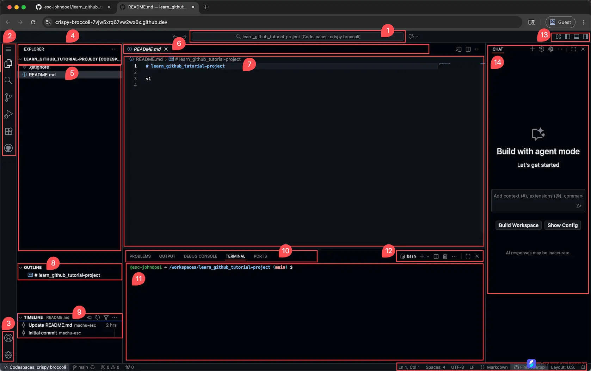

# GitHub Codespaces 界面导览: 认识你的云端开发环境

## 1. 概览

第一次打开 Codespaces, 很多人的反应是: "这么多按钮和窗口, 这都是什么?" 这是完全正常的反应, 即使是经验丰富的开发者, 第一次用新的 IDE 时也会花时间熟悉界面.

Codespaces 使用的是 VS Code, 也就是世界上最流行的代码编辑器. 整体布局就像一个开发者的驾驶舱, 不同的区域负责不同的功能, 一起协同工作. 这个 mini task 会带你一个区域一个区域地把它认全.

**预计用时:** 5 分钟

## 2. 学习目标

学完这个 mini task, 你将能够:

1. 说出 Codespaces 界面的整体布局, 以及每个主要区域的名称
2. 识别 Activity Bar, Side Bar, Editor, Terminal, 底部面板和 AI 助手面板各自的作用
3. 在自己的 Codespace 里自信地找到日常最常用的文件浏览器, 编辑区和终端, 不再对着一堆按钮发懵

## 3. 前置知识

本教程假设你已经成功启动过至少一个 Codespace. 如果还没有, 建议先完成 <GitHub Codespaces: Your First Cloud Development Environment> 里的实战练习, 再回来读这一篇.

## 4. 你将认识到什么

这是一篇纯阅读型教程, 不需要动手操作, 只需要跟着下面的图和讲解, 把界面的 7 个区域一一对上号.



---

## 5. 顶部搜索栏: 快速查找一切

在界面最顶部中央, 有一个搜索框, 显示着你的项目名称和类似 "Codespaces: crispy broccoli" 的字样, 那是 GitHub 给这个 Codespace 自动生成的代号.


这个搜索栏的作用:

- 快速找文件: 我记得有个叫 README 的文件, 在哪儿来着
- 搜索代码: 这个函数名叫什么来着
- 执行命令: 我想做某件事, 应该用什么命令

现在不用深究怎么用, 只需要知道, 当你想快速找什么东西时, 这个搜索栏是起点.

---

## 6. 活动栏: 功能切换中心

界面最左边有一排图标, 这就是 Activity Bar, 点击不同的图标可以切换不同的功能面板.


从上到下主要的图标包括:

文件浏览器 (最常用):

- 图标像一个文件夹
- 点击后, 旁边会显示项目的所有文件和文件夹
- 相当于项目的文件系统地图

搜索:

- 图标是一个放大镜
- 可以在整个项目中搜索文字或代码

源代码管理 (重要):

- 图标像一个树枝分叉, 代表 Git 的 branch
- 这就是 Git 的图形界面版本
- 可以可视化地进行 commit, branch, merge 等操作, 不用敲命令

运行和调试:

- 图标是一个播放按钮
- 用于运行和测试代码

扩展:

- 图标像几个拼在一起的方块
- 可以安装各种插件, 给 VS Code 增加功能

账户:

- 图标是一个人形
- 管理 GitHub 账户的登录状态

设置:

- 图标是一个齿轮
- 调整编辑器的各种偏好设置

现在不需要一次记住所有这些, 只要知道左边这一排是功能切换按钮就够了, 用得多了自然会记住.

---

## 7. 侧边栏: 当前功能的详细内容

紧挨着 Activity Bar 的是一个较宽的面板, 这就是 Side Bar, 显示的内容取决于你在 Activity Bar 里点击了哪个图标.


点击文件浏览器图标时:

- Side Bar 顶部显示 "EXPLORER"
- 下面列出项目的完整文件和文件夹结构, 比如 .gitignore, README.md 以及其他文件

文件浏览器就像电脑上的文件管理器, 只不过它只显示当前项目的文件: 点击文件名可以在中间的编辑区打开它, 右键点击可以创建或删除文件, 文件夹可以展开和收起.

点击源代码管理图标时 (这个很重要):

- Side Bar 会显示 Git 相关的信息
- 可以看到哪些文件被修改过
- 可以直接在这里完成 stage, commit, push 等操作

---

## 8. 编辑区: 代码编写的主战场

界面中间最大的区域是 Editor, 这是你写代码, 编辑文件, 花费大部分时间的地方.


关于编辑区, 有几个值得知道的特点:

标签页: 打开的文件会在顶部显示为标签, 就像浏览器的标签页, 可以同时打开多个文件, 点击切换, 点 X 关闭.

代码高亮: 代码的不同部分会显示不同颜色, 比如注释是灰色的, 关键字是蓝色的, 让代码更容易阅读.

行号: 左侧显示行号, 方便定位和沟通, 比如别人说 "看看第 23 行", 有了行号交流会更清楚.

智能提示: 输入代码时, VS Code 会自动提示可能的补全选项, 像是给代码用的自动完成, 帮你少打字, 少出错.

---

## 9. 终端: 命令行的力量

界面下方有一块深色区域, 显示着一些文字, 这就是 Terminal, 也叫命令行.


什么是终端: 它是用文字而不是点击来和电脑对话的方式. 输入一条命令, 比如 `ls` 用来列出文件, 按下 Enter, 电脑就会给出结果, 不需要鼠标.

为什么需要终端: 有些事情用命令行做起来更快, 更强大:

- 启动一个网站服务器
- 安装软件包, 比如某个 Python 库
- 执行 Git 命令, 比如 `git status`
- 批量操作, 比如一次处理 100 个文件

在终端里, 你会看到类似这样的提示符:

```
@esc-johndoe1 ➜ /workspaces/learn_github_tutorial-project (main) $
```

拆解一下:

- `@esc-johndoe1` 是当前用户名
- `/workspaces/learn_github_tutorial-project` 是当前所在的目录
- `(main)` 是当前所在的 Git 分支
- `$` 表示正在等待输入

别被终端吓到, 它看起来像黑客电影里的画面, 但其实没那么复杂, 这门课会带你逐步接触命令行.

终端上方还有几个标签:

- PROBLEMS: 代码中的错误和警告
- OUTPUT: 程序的输出日志
- DEBUG CONSOLE: 用于调试会话
- TERMINAL: 命令行本身, 最常用的一个
- PORTS: 管理网络端口, 运行本地网站服务器时会用到

现在先记住 TERMINAL 这个标签在哪儿就够了, 其他的等用到时再慢慢熟悉.

---

## 10. 底部面板: 文件结构和历史

在 Side Bar 下方, 还有两个小面板.


OUTLINE:

- 显示当前打开文件的结构
- 对于一个长文件, 可以一眼看到所有章节和函数
- 点击某一项可以直接跳转过去

TIMELINE:

- 显示当前文件的 Git 提交历史
- 可以看到这个文件什么时候被谁改过
- 相当于这个文件的历史日志

---

## 11. AI 助手面板: 可选的编程伙伴

如果安装了 GitHub Copilot, 界面右侧会出现一个聊天面板, 上面写着类似 "Build with agent mode" 的字样.


Copilot 是什么: 它是 GitHub 提供的 AI 编程助手, 可以帮你写代码, 解释已有代码在做什么, 回答问题, 表现得像一位坐在你旁边的资深开发者. 学生可以通过 GitHub Student Developer Pack 免费使用.

这门课不会讲怎么配置 Copilot, 但如果你感兴趣, 值得自己研究一下, 相当于多了一位 24 小时待命的编程导师.

没看到这个面板也没关系, 它是可选的.

---

## 12. 练习

目标: 把这 7 个区域和你自己的 Codespace 界面对上号, 建立肌肉记忆的第一步.

怎么做: 如果手头有已经打开的 Codespace, 一边读上面每个区域的讲解, 一边在真实界面里找到对应的位置, 点一点 Activity Bar 里的各个图标, 看 Side Bar 内容怎么变化. 如果暂时没有打开的 Codespace, 只读文字和截图, 建立一个大致的印象即可.

你会观察到: 点击 Activity Bar 里不同的图标, Side Bar 的内容会随之切换, 而 Editor 和 Terminal 的位置始终不变, 这说明整个界面是围绕 "左边选功能, 中间写代码, 下面跑命令" 这个模式设计的.

关键洞见: 你不需要一次记住所有细节. 先认清 File Explorer, Editor, Terminal 这三个最常用的区域, 剩下的等用到时再学, 这已经覆盖了日常工作的大部分场景.

## 13. 回顾

这篇教程带你认识了 Codespaces 界面的主要区域:

1. 顶部搜索栏: 快速查找文件, 代码和命令
2. Activity Bar (左侧竖条): 功能切换中心, 点不同图标换不同面板
3. Side Bar: 文件浏览器, Git 状态等内容随 Activity Bar 的选择变化
4. Editor (中间): 写代码, 编辑文件的主战场
5. Terminal (底部): 命令行入口, 用文字和电脑对话
6. 底部面板: OUTLINE 显示文件结构, TIMELINE 显示 Git 历史
7. AI 助手面板 (右侧, 可选): GitHub Copilot 聊天窗口

## 14. 导师寄语

想象你第一次坐进汽车驾驶座: 方向盘, 档位, 仪表盘上一堆按钮, 一开始很容易觉得复杂, 但练习几次之后这些会变成肌肉记忆. Codespaces 也是一样.

给你三个建议:

1. 先熟悉最基本的三样: File Explorer, Editor 和 Terminal, 这已经覆盖你日常 80% 的使用场景.
2. 其他功能随用随学: 用到什么就去查, 或者直接问 AI 助手.
3. 大胆点, 随便点: 你在的是云端环境, 怎么点都不会把电脑弄坏.
