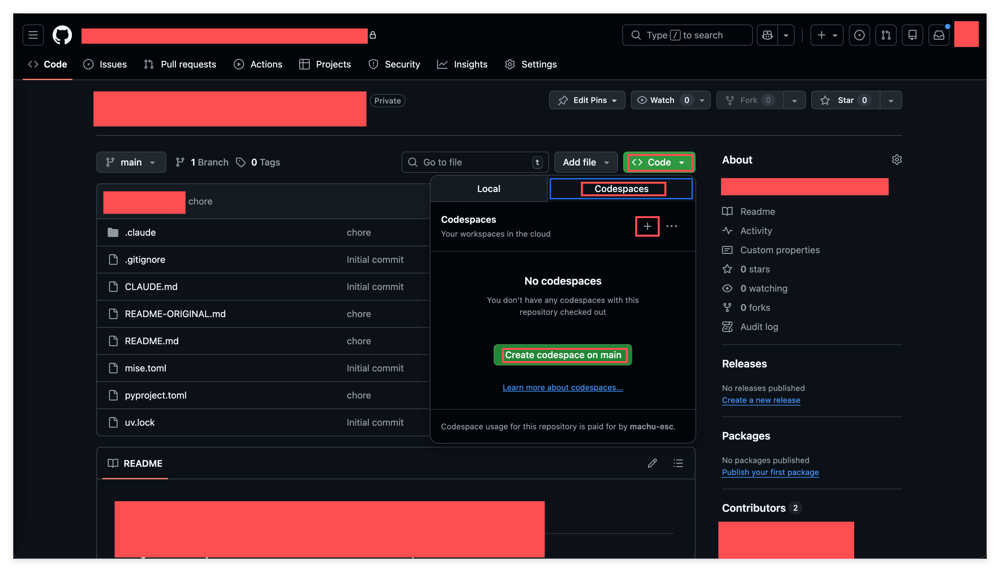

# GitHub Codespaces 入门: 认识云端开发环境

## 1. 概览

配置开发环境, 是初学者遇到的最大障碍之一. 不同操作系统, 互相冲突的软件版本, 缺失的 PATH 配置, 这些问题足以让你在写下第一行代码之前就耗掉好几天. 云端开发环境的出现, 就是为了解决这个问题: 它在浏览器里给你一个随开随用, 配置一致的开发环境.

---

## 2. 学习目标

想象一下这个场景: 你刚开始学编程, 兴冲冲地想跟着教程写第一行代码. 教程说, 第一步, 安装 Python. 听起来很简单对吧? 但实际上: 你下载了一个版本, 发现是 32 位的, 你的电脑是 64 位; 安装时忘了勾选 Add to PATH, 命令行找不到 Python; 好不容易装好了, 又发现和电脑上已有的版本冲突了; 你去网上搜解决方案, 发现 10 个教程有 10 种不同的说法. 一周过去了, 你还没写出第一行代码.

这不是你的问题, 是配置环境这件事本身就很难. 云端开发环境, 就是为了让你绕过这个大坑而存在的.

学完这个 mini task 你将能够:

1. 说明云端开发环境是什么, 以及它为什么能帮初学者绕开配置环境的坑
2. 说清 GitHub Codespaces 的基本概念和每月免费额度规则
3. 亲手完成一次启动, 使用, 停止和删除 codespace 的完整流程
4. 区分 stop (停止) 和 delete (删除) 一个 codespace 分别意味着什么

---

## 3. 前置知识

- 一个 GitHub 账号 (免费版即可)
- 一个网页浏览器
- 基本的复制粘贴和点击操作能力

---

## 4. 你将构建或学到什么

这一课不会让你搭建任何应用. 相反, 你会通过创建, 使用, 管理你的第一个 codespace, 获得对云端开发环境的直接体验. 这项基础技能, 会让你之后所有的学习项目都更顺畅.

---

## 5. 云端开发环境是什么

传统的做法, 是把所有开发工具装在你自己的电脑上. 问题在于每个人的电脑都不一样: 操作系统不同, 已经装了什么软件不同, 系统设置也不同. 于是就有了那句经典的 "在我电脑上能跑, 在你电脑上就不行".

云端的做法是把开发环境搬到远程服务器上, 你通过浏览器访问它. 这样一来, 不管你用的是什么电脑, 配置高低如何, 只要能打开浏览器, 拿到的就是一个完全一致, 已经配置好的环境.

GitHub Codespaces 就是 GitHub 提供的这样一项服务. 说得具体一点, 它在 GitHub 的服务器上给你开了一台虚拟电脑, 上面预装好了常用的开发工具, 你用浏览器就能访问, 用起来和一个网页应用差不多. 你的代码和文件都保存在云端, 下次打开还能接着上次的工作继续.

至于费用, GitHub 给每个用户提供了免费的使用时长, 对学习来说完全够用: 用最小配置的机器算下来每月大约 60 小时, 只有运行时才计费, 停止的 codespace 不消耗额度, 而且 30 分钟无操作会自动停止, 不用担心忘记关掉白白浪费. 具体的计费规则后面会有专门一篇讲.

---

## 6. 云端开发环境的三大好处

第一个好处是环境一致. 所有人的 codespace 都长得一样, 这意味着你遇到问题时别人能准确地帮你, 教程上的步骤在你这里一定能复现, 也不会再有 "为什么我的不行" 这种无从下手的困惑.

第二个好处是隔离风险. 当你想尝试一个新工具, 新框架, 或者运行一段自己也不太确定的代码时, 在自己电脑上搞砸了, 可能会污染系统环境, 想卸载都卸不干净; 在云端环境里搞砸了, 删掉重建就行, 你的电脑不受任何影响. 这一点对学习尤其重要, 因为它让你敢于大胆尝试.

第三个好处是安全. 想试用一个不太知名的软件, 或者运行一段来历不明的代码, 放在自己电脑上多少有点风险, 万一是恶意软件呢? 放在云端环境里, 即使真出了问题, 也影响不到你的个人电脑和数据. 云端环境在这个意义上就像一个沙盒, 一个隔离的, 安全的实验空间.

---

## 7. 不只是 GitHub

这门课用的是 GitHub Codespaces, 但云端开发环境这个赛道上并不只有它一家. Gitpod 是另一个流行的选择, Replit 特别适合快速实验和分享代码, CodeSandbox 主要面向前端开发, Google Cloud Shell 和 AWS Cloud9 则分别是 Google 和 Amazon 提供的版本.

选 GitHub Codespaces 是因为它和 GitHub 深度集成, 而且对个人用户的免费额度非常慷慨. 但云端开发的理念是通用的, 学会了这套思维方式, 换到任何平台都能用上.

---

## 8. 练习: 启动, 使用与清理你的第一个 codespace

现在动手体验一下. 这个练习不需要任何编程基础, 会点鼠标, 会复制粘贴就够了.

### 步骤 1: 启动 codespace

登录 GitHub, 进入你自己的任意一个 repository 页面. 在文件列表上方靠右的位置找到绿色的 Code 按钮, 点开它, 在弹出的下拉菜单里会看到 Local 和 Codespaces 两个标签, 切到 Codespaces, 然后点击绿色的 Create codespace on main.



接下来等 30 秒到 2 分钟, codespace 会自动启动. 启动完成后你会看到一个代码编辑器的界面, 这就是运行在云端的 VS Code 网页版. 界面下方那块黑色区域是终端 (Terminal), 下一步会用到它.

停下来想一想这件事的意义: 你现在拥有了一个完整配置好的开发环境, 而你的电脑上什么都没装.

### 步骤 2: 在终端执行命令

在终端里输入下面这条命令, 按回车:

```
echo "Hello World"
```

终端应该会输出 `Hello World`, 这说明你的云端环境能正常工作. 接着输入这条命令创建一个文件:

```
echo "This is a message" >> ~/message.txt
```

它会创建一个叫 `message.txt` 的文件, 内容是 `This is a message`. 最后验证一下文件确实建好了:

```
cat ~/message.txt
```

你会看到输出 `This is a message`. 注意这些命令的用法和在本地电脑上完全一样, 云端环境的行为就像一台普通电脑, 没有任何特殊之处.

### 步骤 3: 停止 codespace, 保留数据

现在假设你今天不做了, 想暂时把它放下. 点击浏览器界面左下角显示的 Codespaces: xxx 字样, xxx 是 GitHub 自动生成的一个代号, 比如 "crispy broccoli". 在弹出的菜单里选择 Stop Current Codespace.


也可以换个入口: 访问 [github.com/codespaces](https://github.com/codespaces), 找到你的 codespace, 点右侧的 `...` 按钮, 选 Stop codespace.

停止一个 codespace, 就像让电脑进入睡眠状态: 工作内容原样保留, 但你不再消耗额度.

### 步骤 4: 重启并验证数据还在

刚才那句 "工作内容原样保留" 值得亲自验证一次, 不然很难真的放心.

访问 [github.com/codespaces](https://github.com/codespaces), 找到刚才那个显示 Stopped 状态的 codespace, 点它的名字. 等几秒钟恢复运行后, 在终端里再输入一次:

```
cat ~/message.txt
```

`This is a message` 还在. 文件在停止和重启之间原样保留, 你安装过的软件包也一样. 停止一个 codespace 不会丢失任何东西, 只有删除才会.

### 步骤 5: 删除 codespace, 彻底清除

最后体验一下删除. 访问 [github.com/codespaces](https://github.com/codespaces), 找到你的 codespace, 点右侧的 `...` 按钮, 选择 Delete 并确认.

删除之后这个 codespace 就彻底消失了. 如果你再新建一个, 之前那个 `message.txt` 不会存在. 这不是坏事: 用完就删能让你的工作区保持干净, 避免闲置环境越堆越多.

---

## 9. 回顾: 停止与删除的区别

| 操作 | 数据 | 额度消耗 | 适用场景 |
| :--- | :--- | :--- | :--- |
| Stop (停止) | 保留 | 停止计费 | 暂时休息, 稍后继续 |
| Delete (删除) | 清除 | 不再占用 | 不再需要这个环境 |

一个简单的记法: Stop 是关电脑, 数据还在硬盘里; Delete 是把电脑扔掉, 什么都没了.

---

## 10. 导师寄语

完成这节课后, 你可能会想: 不就是一个云端编辑器吗? 有什么大不了的? 让我告诉你一个更深层的道理.

学任何东西, 先找一个好的练习场. 想象你要学滑冰: 糟糕的练习场, 崎岖不平的冰面, 周围全是人, 摔倒了很痛; 好的练习场, 平整的冰面, 人少, 有护栏, 摔倒了也不怕. 在糟糕的练习场里, 你的注意力都花在不要摔倒, 不要撞到人上, 根本没法专心学技巧.

学编程也一样: 糟糕的环境, 配环境花一周, 代码跑不起来不知道是自己写错了还是环境问题, 改错了怕弄坏电脑; 好的环境, 打开浏览器就能用, 出错了清楚知道是代码的问题, 随便折腾不怕搞坏任何东西.

云端开发环境, 就是你学习编程的好练习场.

这个思维可以迁移. 不只是编程, 学任何新东西都应该问自己: 有没有一个低成本, 快速反馈, 可以安全犯错的环境让我练习? 学外语, 找一个不怕出丑的语伴或 AI 对话. 学投资, 先用模拟盘. 学设计, 先用免费工具做小项目.

找到一个好的练习环境, 有时候比学习具体内容还重要. 因为好的环境能让你更快地试错, 更快地得到反馈, 更快地成长.

今天你学到的不只是怎么用 GitHub Codespaces, 而是一种思维方式: 在开始学习之前, 先给自己找一个简单, 方便, 可以快速试错的环境. 这个思维, 会让你在学习任何新东西时都事半功倍.

---

## 11. 速查

**管理 codespaces:**

访问你的 codespaces 控制台: [github.com/codespaces](https://github.com/codespaces)

- 停止 codespace: 点击左下角的 Codespaces 状态 → Stop Current Codespace
- 删除 codespace: 控制台 → `...` → Delete

**用到的关键命令:**

```bash
echo "Hello World"              # 向终端打印文字
echo "text" >> file.txt         # 把文字追加写入文件
cat file.txt                    # 显示文件内容
```

**关键事实:**

- 免费额度用最小配置的机器算, 每月大约 60 小时
- 30 分钟无操作自动停止
- 停止的 codespace 不消耗额度
- 停止的 codespace 保留数据, 删除的 codespace 会丢失一切

**官方文档:**

- [GitHub Codespaces 快速入门](https://docs.github.com/zh/codespaces/getting-started/quickstart)
- [什么是 GitHub Codespaces?](https://docs.github.com/zh/codespaces/overview)
