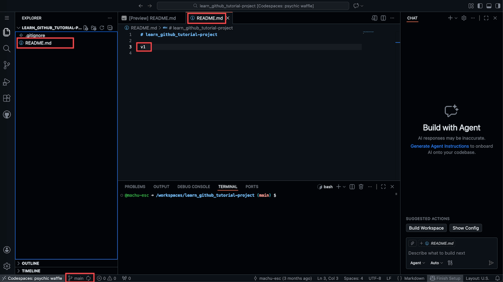
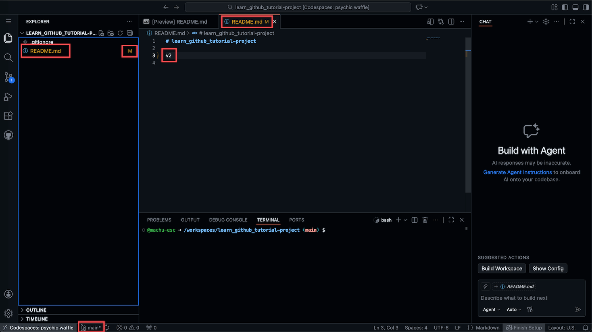
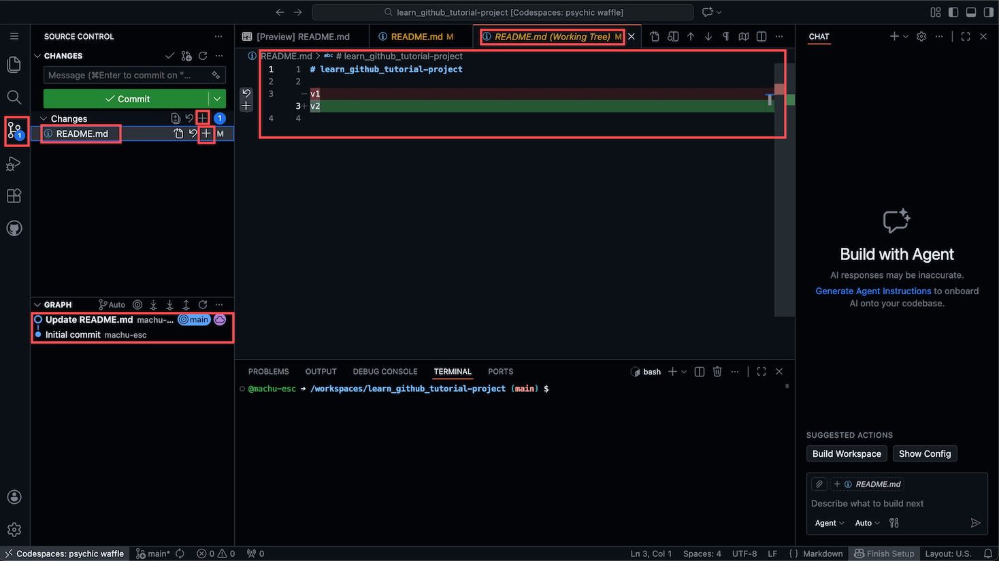
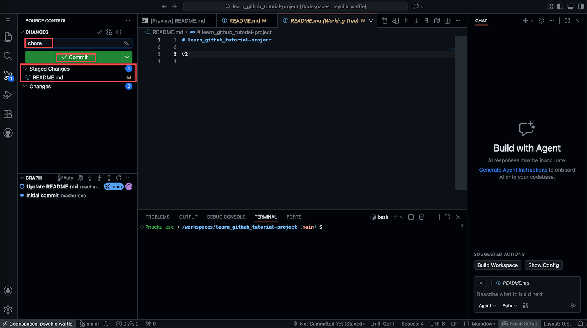

# 在 Codespaces 中修改文件并推送到 GitHub

## 1. 概览

Codespaces 是一个很好的实验环境, 你可以在云端随意修改代码, 不用担心弄坏本地环境. 但这里有个容易被忽略的坑: 如果你只是编辑了文件, 却没有 commit 和 push, 这些改动其实并没有被真正保存下来. 它们只存在于这一个 Codespace 里, 别人看不到, GitHub 网站上也看不到, 一旦这个 Codespace 被删除, 改动就彻底丢失了.

所以, 学会 commit (提交) 和 push (推送) 非常重要: 只有做完这两步, 你的工作才真正被保存下来, 成为项目历史的一部分.

---

## 2. 学习目标

学完这个 mini task, 你将能够:

1. 在 Codespaces 编辑器里修改文件, 并识别出文件被修改后出现的视觉提示.
2. 说清楚 Stage 和 Commit 的区别, 以及 Git 为什么要把它们设计成两个独立步骤.
3. 独立走完一次 Stage 到 Commit 到 Push 的完整流程, 把本地改动发布到 GitHub.
4. 判断一次改动到底有没有真正对外可见, 也就是理解 push 之前和 push 之后的区别.

---

## 3. 前置知识

你需要已经会启动一个 Codespace, 并且对 Codespaces 的基本界面有一定了解.

---

## 4. 你将构建或学到什么

你会在一个已有仓库里对某个文件做一次真实的修改, 完整走一遍 Edit 到 Stage 到 Commit 到 Push 的流程, 并在 GitHub 网站上亲眼确认这次改动真的生效了.

---

## 5. 查看初始状态

打开你的 Codespace, 在左侧文件浏览器中点击一个文件, 比如 `README.md`, 它会在编辑区打开.

观察几个关键点:

- 文件名是白色的, 说明这个文件还没有被修改过.
- 底部状态栏显示 `main`, 说明你当前在 main 分支上.
- 编辑区显示文件内容, 比如现在内容是 `v1`.

这就是初始状态, 一切都很干净, 没有任何改动.

---

## 6. 修改文件并观察变化

在编辑区里修改文件内容, 比如把 `v1` 改成 `v2`, 然后按 `Ctrl+S` (Mac 上是 `Cmd+S`) 保存.

保存后, 观察界面上的变化:

- 文件名变成橘黄色, 表示这个文件已被修改.
- 文件名旁边出现 `M` 标记, M 代表 Modified (已修改).
- 底部状态栏的 `main` 后面多了一个星号 `*`, 表示当前分支上有未提交的改动.

这些视觉提示能帮你一眼看出哪些文件被改过了, 还有多少工作没有保存.

---

## 7. 打开源代码管理面板并 Stage 改动

点击左侧活动栏的源代码管理图标 (看起来像树枝分叉的图标, 可能会显示一个蓝色数字, 表示有多少文件被修改).

在 SOURCE CONTROL 面板中, 你会看到:

- Changes 区域: 列出所有被修改的文件.
- 文件名旁边的 `+` 号: 点击可以 Stage 这个文件; 面板上方还有一个 `+` 号, 可以一次性 Stage 所有改动.

什么是 Stage? 可以想象你在整理房间, 准备搬家:

- 修改文件, 相当于你把东西从柜子里拿出来, 堆在地上.
- Stage, 相当于你把要带走的东西放进纸箱, 但还没封箱.
- Commit, 相当于你封好箱子, 贴上标签, 正式打包完成.

Stage 是一个中间步骤, 它让你可以选择性地决定哪些改动要包含进这次提交. 比如你改了 10 个文件, 但只想提交其中 3 个, 就可以只 Stage 那 3 个.

点击 `README.md` 旁边的 `+` 号, 把它移动到 Staged Changes. 此时如果你在侧边栏选中 `README.md`, 编辑区会显示这个文件的具体改动: 红色背景是被删除的旧内容, 绿色背景是被添加的新内容, 方便你确认自己到底改了什么.

---

## 8. 写 Commit 消息并提交

Stage 完成后, 文件会从 Changes 移动到 Staged Changes.

在顶部的 Message 输入框里, 输入一段描述这次改动的消息, 例如:

- `Update README to v2`, 正式项目里推荐这样写清楚改了什么.
- `chore`, 如果只是琐碎的, 不重要的改动, 简单写这个也可以, 这是一个常见的约定.

然后点击 Commit 按钮. Commit 之后发生了什么:

- 你的改动被正式记录在本地的 Git 历史中.
- Staged Changes 区域被清空.
- 但这个 commit 目前只存在于你的 Codespace 里, GitHub 网站上还看不到.

---

## 9. Push 到 GitHub

Commit 完成后, 界面会发生一些变化.

观察几个关键点:

- 出现一个 Sync Changes 按钮, 点击它可以把本地的 commit 推送到 GitHub.
- 底部状态栏可能会显示类似 `0 ↓ 1 ↑` 的字样: ` ↑` 表示你有多少个本地 commit 还没推送到 GitHub, ` ↓` 表示 GitHub 上有多少个 commit 你还没拉取到本地.
- 左侧 GRAPH 面板会显示你刚才的 commit 记录, 它已经成为项目历史的一部分.

点击 Sync Changes 按钮, 或者点击状态栏的向上箭头 ` ↑`. 推送完成后:

- 你的改动正式上传到了 GitHub 服务器.
- 任何人访问这个仓库都能看到你的改动.
- 在 GitHub 网站上刷新页面, `README.md` 的内容会变成 `v2`.

到这里, 你就完成了一次完整的 Edit 到 Stage 到 Commit 到 Push 循环.

---

## 10. 为什么要分 Stage 与 Commit 两步

你可能会问: 为什么不能直接 Commit, 还要先 Stage 呢?

简单回答: Stage 让你有更精细的控制权. 设想这样一个场景, 你正在开发一个功能, 改了 5 个文件, 但其中 2 个还没调整好, 你只想先提交那 3 个确定没问题的. 没有 Stage 的话, 你只能要么全部提交, 要么全部不提交; 有了 Stage, 你可以只 Stage 那 3 个文件, 先提交它们, 剩下 2 个继续修改, 之后再单独提交.

对初学者的建议: 刚开始学习时, 完全可以走简单流程, 改完所有文件, 全部 Stage, 一次性 Commit. 等你更熟练了, 再考虑用 Stage 做更精细的版本控制.

---

## 11. 练习

目标: 在你自己名下的仓库里, 独立走完一次 Edit 到 Stage 到 Commit 到 Push, 并在 GitHub 上确认改动真的生效了.

怎么做:

1. 打开你自己名下任意一个仓库的 Codespace.
2. 如果仓库里有 `README.md`, 给它加一行文字; 没有的话就新建一个文件.
3. 保存文件, 观察文件名颜色和 `M` 标记的变化.
4. 打开源代码管理面板, 把改动 Stage 起来.
5. 写一条简短的 commit 消息, 点击 Commit.
6. 点击 Sync Changes, 或者点击状态栏的上箭头, 把改动 Push 到 GitHub.
7. 刷新 GitHub 上的仓库页面, 确认改动已经出现在那里.

你会观察到: 文件名从白色变成橘黄色并带上 `M` 标记; Stage 之后文件从 Changes 移动到 Staged Changes; Commit 之后本地历史多了一条记录, 但 GitHub 上还看不到任何变化; Push 完成后状态栏的 ` ↑` 计数清零, 刷新 GitHub 页面能看到新内容.

关键洞见: 只有 Push 完成之后, 改动才真正离开你的 Codespace, 变成别人也能看到的项目历史的一部分. Commit 只是本地记录, 并不等于对外发布.

---

## 12. 回顾

- 修改文件后会有清晰的视觉提示: 橘黄色文件名, `M` 标记, 分支名后的星号.
- Stage 是选择要提交什么, 把改动放进待提交的篮子里.
- Commit 是正式记录改动, 在本地 Git 历史中留下一笔.
- Push 是上传到 GitHub, 让改动对所有人可见.
- 只有完成 Push, 改动才会出现在 GitHub 网站上.

---

## 13. 导师寄语

你刚才学的这套操作, Stage, Commit, Push, 其实是 Git 版本控制的核心概念. Codespaces 里的这个界面只是 Git 众多图形界面之一, 还有很多其他工具能做同样的事情: GitHub Desktop (GitHub 官方的桌面客户端), 本地版 VS Code (界面和 Codespaces 几乎一样), SourceTree 与 GitKraken (第三方 Git 图形界面), 以及命令行 (`git add`, `git commit`, `git push`).

这些工具的界面各不相同, 但核心流程始终是一样的: 修改文件, Stage 选择要提交的内容, Commit 在本地记录快照, Push 上传到远程服务器. 学会了一个工具, 其他工具也能很快上手.

关于命令行还有一点值得一提: 你可能见过 `git add`, `git commit -m "message"`, `git push` 这些命令, 它们做的事情和你刚才点按钮完全一样. 这篇教程故意没有讲命令行, 因为这里的目标是先把改动推送出去, 图形界面已经够用了; 命令行学习曲线更陡, 现在不是必需的; 先把概念吃透, 工具可以慢慢学. 不过命令行终究值得学, 大多数有经验的开发者更熟练之后都会更喜欢用命令行, 因为更快; 一旦 Git 的心智模型建立起来, 命令行会显得很自然.
