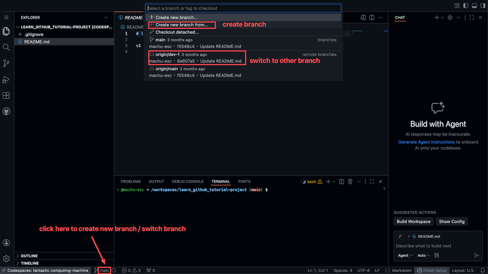

# 在 Codespaces 中创建和切换分支

## 1. 概览

在实际项目中, 你通常不会直接在 `main` 分支上修改代码, 而是先创建一个独立分支进行开发, 测试没问题后再通过 Pull Request (PR) 合并回 `main`. 这篇教程带你在 GitHub Codespaces 里走一遍切换分支, 创建分支, 推送分支, 直到通过 PR 合并的完整流程.

---

## 2. 学习目标

`main` 分支是项目的正式版本, 直接在上面改代码风险很大: 一旦改坏, 所有人都会受影响. 正确的做法是先在一个独立分支里开发, 随便折腾都不会影响 `main`, 测试没问题后再通过 PR 合并回去, 经过审核后改动才正式生效. 学会创建分支和切换分支, 是进行正规项目开发的必备技能.

学完这个 mini task, 你将能够:

1. 在 Codespaces 中切换分支 (branch)
2. 创建新分支
3. 理解为什么切换分支前需要先处理未提交的改动
4. 完成一次完整的 create branch, edit, commit, push, PR merge 闭环

---

## 3. 前置知识

- 已经会在 Codespaces 中进行 stage, commit, push 操作

---

## 4. 你将构建或学到什么

你会走完一次真实的分支协作流程: 创建自己的练习分支, 修改一个文件, 提交并推送到 GitHub, 再开一个 Pull Request 并将它合并回 `main`, 最终得到一个可以拿给别人看的, 已经成功合并的 PR 链接.

---

## 5. 切换分支

### 如何切换分支

在 Codespaces 界面的底部状态栏, 你会看到当前分支的名称 (比如 `main`).

点击这个分支名称, 会弹出一个菜单, 显示:

- **Create new branch...**: 创建新分支
- **Create new branch from...**: 基于某个分支创建新分支 (推荐)
- **branches** (本地分支): 列出所有本地分支, 点击即可切换
- **remote branches** (远程分支): 列出 GitHub 上的分支

要切换到其他分支, 直接点击你想切换到的分支名称即可.

### 切换前先处理未提交的改动

这是一个常见的坑: 如果你修改了文件但还没有 commit, Git 可能会阻止你切换分支.

为什么? 想象这个场景: 你在 `main` 分支上改了 `README.md`, 但还没提交. 现在你想切换到 `dev` 分支. Git 会困惑:

- 这个改动是属于 `main` 分支的, 还是要带到 `dev` 分支去?
- 如果直接切换, 这个改动会丢失吗?

Git 不知道你的意图, 所以它会报错或警告, 阻止你切换.

解决方法:

1. 如果改动已经完成: 先 commit, 再切换
2. 如果改动还没完成, 但想暂时保存: 使用 stash (暂存) 功能
3. 如果改动不重要, 可以丢弃: 放弃这些改动, 然后切换

最简单的建议: 养成习惯, 切换分支前先 commit 你的改动.

---

## 6. 创建新分支

### 推荐方式: Create new branch from...

点击底部状态栏的分支名称, 选择 **Create new branch from...**.

这个选项的好处是: 你可以明确选择基于哪个分支来创建新分支.

步骤:

1. 点击底部的分支名称 (比如 `main`)
2. 选择 **Create new branch from...**
3. 选择一个基础分支 (base branch), 比如选择 `main`
4. 在顶部输入框中输入新分支的名称, 比如 `feature-update-readme`
5. 按回车确认

创建完成后, 你会自动切换到新分支. 底部状态栏会显示新的分支名称.

### 分支命名建议

给分支起一个有意义的名字, 让别人一眼就知道这个分支是干什么的:

- `feature-xxx`: 新功能开发, 比如 `feature-add-login`
- `fix-xxx`: 修复问题, 比如 `fix-typo-in-readme`
- `你的名字-dev`: 个人开发分支, 比如 `john-dev`

避免使用无意义的名字, 比如 `test`, `branch1`, `aaa`.

---

## 7. 推送新分支到 GitHub

重要: 创建分支后, 这个分支只存在于你的 Codespace 本地, GitHub 上还没有这个分支.

你需要把新分支 push 到 GitHub:

1. 在新分支上做一些修改 (或者不修改也行)
2. 点击底部状态栏的向上箭头 `↑`, 或点击 **Sync Changes**
3. 第一次 push 新分支时, 可能会提示你是否要发布这个分支, 点击确认即可

push 之后, 这个分支才会出现在 GitHub 网站上.

---

## 8. 完整闭环: 创建分支, 修改, 提交, PR 合并

现在让我们把之前学过的知识串起来, 完成一次完整的开发流程.

### 第 1 步: 创建新分支

1. 点击底部分支名称
2. 选择 **Create new branch from...**
3. 选择 `main` 作为基础分支
4. 输入新分支名称, 比如 `update-readme-v2`
5. 按回车, 自动切换到新分支

### 第 2 步: 修改文件

1. 打开 `README.md` (或其他文件)
2. 做一些修改
3. 保存文件 (Ctrl+S 或 Cmd+S)

### 第 3 步: Stage 和 Commit

1. 点击左侧源代码管理图标
2. 点击文件旁边的 `+` 号进行 stage
3. 输入 commit 消息
4. 点击 **Commit** 按钮

### 第 4 步: Push 到 GitHub

1. 点击 **Sync Changes**, 或点击底部的向上箭头
2. 确认发布分支 (如果有提示)

### 第 5 步: 创建 Pull Request 并合并

1. 打开 GitHub 网站, 进入你的 repository
2. 你应该会看到一个黄色提示: "xxx had recent pushes"
3. 点击 **Compare & pull request**
4. 填写 PR 标题和描述
5. 点击 **Create pull request**
6. 确认没问题后, 点击 **Merge pull request**
7. 合并完成

---

## 9. 练习

### 练习 1: 走一遍完整的 PR 工作流

**目标:** 独立完成一次 create branch, edit, commit, push, 到 PR merge 的完整闭环.

**怎么做:**

1. 在你自己的一个 repository 里打开 Codespace
2. 用 **Create new branch from...** 基于 `main` 创建一个新分支
3. 修改一个文件并保存
4. 依次完成 stage, commit, 写一条清楚的 commit 消息
5. push 到 GitHub, 如果提示发布分支就点击确认
6. 在 GitHub 上打开 Pull Request, 检查改动无误后 merge

**你会观察到:** 分支从只存在于本地, 到 push 后出现在 GitHub 上, 再到 PR 页面里的改动逐条展示, 最后合并按钮变成不可点击的已合并状态.

> **关键洞见:** 整个过程你没有敲一条 Git 命令, 但完成的正是专业团队每天在做的 create branch, edit, commit, push, merge 工作流.

---

## 10. 回顾: 我们学到了什么

- 点击底部分支名称可以切换分支或创建新分支
- 切换分支前先 commit, 避免未提交的改动导致问题
- 推荐用 **Create new branch from...**, 明确知道基于哪个分支创建
- 新分支要 push 才能在 GitHub 上看到, 本地创建不等于远程已经存在
- 完整流程是闭环的: 创建分支, 修改, commit, push, PR 合并

---

## 11. 导师寄语

**为什么这个练习重要:**

恭喜你, 走到这里, 你已经学会了 commit (记录代码改动), push (将改动上传到 GitHub), branch (创建和切换分支), Pull Request (合并分支). 这就是 Git 版本控制的核心工作流. 虽然一个 Git 命令都没学, 但你已经能够在独立的分支上开发而不影响主分支, 提交和推送你的改动, 通过 PR 进行代码合并.

**关键洞见:**

- 你可能听说过 `git checkout`, `git branch`, `git merge` 这些命令, 它们做的事情和你点按钮是一样的
- 工具会变, 但概念是通用的: 理解了 branch, commit, push, PR 这些概念, 将来无论用什么工具, 什么命令, 都能快速上手

**下一步:**

如果将来遇到问题, 或者图形界面搞不定的情况: 截图或复制错误信息, 让 AI 帮你分析和 debug, 在 Codespace 里尝试 AI 给的命令 (反正是云端环境, 不怕搞坏), 只要不 push, 所有改动都只在本地, 随时可以重来.
