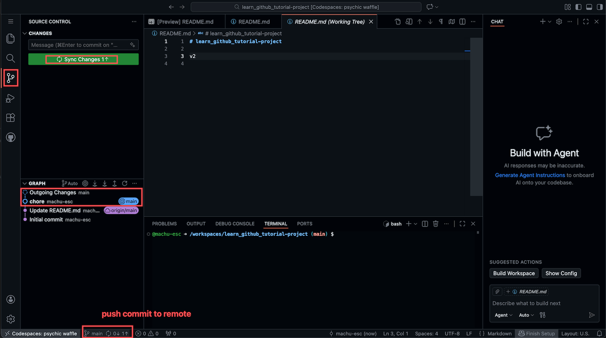

# 分支日常操作: 六个最容易卡住的地方

## 1. 概览

上一篇你已经走完了一次完整的 PR 流程, 从建分支到合并回 `main`. 但真正开始用分支干活之后, 会冒出一批教程通常不讲的小问题, 它们不难, 只是没人告诉你答案的时候会卡很久:

我现在到底在哪个分支? 怎么切到别的分支去? 新建分支的时候它问我基于哪个分支, 我该选什么? 手上还有没提交的改动, 能切吗, 切了会不会丢? 想在本地把一个分支合进另一个, 按钮在哪? push 和 pull 到底谁往哪个方向走?

这一篇就把这六个问题一次讲透. 它们全都能在 Codespaces 的界面里点出来, 不需要敲一条命令.

---

## 2. 学习目标

学完这个 mini task, 你将能够:

1. 从界面上的两个地方随时确认自己在哪个分支, 以及这个分支有没有未保存的工作
2. 在本地分支和远程分支之间切换
3. 创建新分支时明确选择基础分支, 并说清楚选错会带来什么后果
4. 处理切换分支时遇到的未提交改动, 分清 Stash & Checkout, Migrate Changes, Force Checkout 三个选项各自会做什么
5. 在本地把一个分支合并进另一个分支, 并说清楚合并的方向
6. 读懂状态栏的同步指示器, 知道 push, pull 和 Sync 分别在做什么

---

## 3. 前置知识

- 会在 Codespaces 里完成 stage, commit, push
- 走过一次从创建分支到 PR 合并的完整流程

---

## 4. 你将构建或学到什么

这是一篇偏速查性质的 mini task. 你不会搭建什么新东西, 而是把分支操作里那些一卡就卡半小时的地方逐个扫掉, 读完之后手边就有了一份遇到问题可以随时翻回来的参考.

---

## 5. 我现在在哪个分支

答案在界面左下角. 状态栏最左边那一块, 挨着 Codespaces 名字的位置, 显示的就是你当前所在的分支.


这一小块地方信息量比看上去大, 值得多看两眼:

分支名本身告诉你在哪, 图里显示的是 `main`. 分支名后面如果跟着一个星号, 比如 `main*`, 说明这个分支上有已经改了但还没 commit 的文件. 再往右的 `0 ↓ 1 ↑` 是同步状态, 后面第 10 节会专门讲.

还有第二个地方也能确认, 而且很多人反而先注意到它: 终端的提示符里, 括号里的那个词就是当前分支.

```
@machu-esc ➜ /workspaces/learn_github_tutorial-project (main) $
```

两个地方显示的一定是同一个分支. 养成切换之后瞄一眼左下角的习惯, 能省掉很多 "我怎么改到 main 上去了" 的意外.

---

## 6. 切换到别的分支

点一下状态栏上的分支名, 顶部会弹出一个列表, 这就是所有分支操作的总入口.

列表分成几段. 最上面三行是创建类操作, 下面 `branches` 那一段是你本地已经有的分支, 再下面 `remote branches` 那一段是 GitHub 上有, 但你本地还没拉下来的分支. 图里 `origin/dev-1` 就属于后者.

要切换, 直接点你想去的分支名就行, 界面会重新加载文件, 左下角的分支名随之变化.

这里有个细节值得知道: 点一个 `origin/` 开头的远程分支时, Git 会自动帮你在本地建一个同名分支, 并且让它跟踪那个远程分支. 也就是说你点 `origin/dev-1`, 落地之后你在的是本地的 `dev-1`, 之后 push 和 pull 都会自动对准远程的 `dev-1`, 不需要你额外配置.

---

## 7. 创建新分支, 以及基于谁

弹出列表的顶部有两个看起来差不多的选项, 但它们的区别恰恰是新手最容易踩的地方:

Create new branch... 直接问你要新分支的名字, 基础分支默认就是你当前所在的分支. Create new branch from... 会先让你挑一个基础分支, 然后再问名字.


推荐一律用带 `from...` 的那个, 理由很实际: 前者默认基于当前分支, 而当前分支是什么, 恰恰是你最容易记错的事情. 一旦你人还在上个任务的 `feature-login` 分支上, 却以为自己在 `main`, 那么新建出来的分支就会带着 `feature-login` 的所有改动. 等你开 PR 的时候会发现里面混进来一堆不是你这次写的东西, 审查的人也会一头雾水.

选择基础分支的界面就是图里这个样子. 通常你要选的是 `main`, 因为你想基于项目当前的正式版本开始新工作. 选完之后在顶部输入框里填新分支的名字, 回车确认, 你会自动切换到新分支上.

关于命名, 让别人一眼看出这个分支在干什么就够了: `feature-add-login` 表示新功能, `fix-typo-in-readme` 表示修问题, `john-dev` 表示某个人的个人开发分支. 避开 `test`, `branch1`, `aaa` 这类过几天你自己都想不起来是什么的名字.

最后有一件事容易被忽略: 新建的分支此刻只存在于你的 Codespace 里, GitHub 上还没有它. 要让别人看到, 得先 push 一次, 具体怎么做见第 10 节.

---

## 8. 手上还有没提交的改动, 能切吗

这是六个问题里最让人不安的一个, 因为它关系到会不会丢东西. 先说结论, 可能和你的直觉不一样:

大多数时候你直接切就行, 改动会被原样带到新分支上. Git 并不会因为你有未提交的改动就一律拦你.

Git 只在一种情况下拦: 你改动的那个文件, 在两个分支之间本来内容就不一样. 这时候切过去就意味着要用目标分支的版本覆盖你正在改的内容, Git 不敢替你做这个决定, 于是弹出一个对话框:

```
Your local changes would be overwritten by checkout.
```

下面给你三个按钮. 它们的名字不太自解释, 但行为差别很大:

Stash & Checkout 会把你的改动收进一个叫 stash 的暂存区, 然后干干净净地切过去. 你的改动没丢, 但也没跟着走, 它躺在 stash 里等你回来取. 适合这些改动本来就属于原来那个分支的情况.

Migrate Changes 会先收进 stash, 切过去, 再立刻把 stash 里的东西取出来铺在新分支上. 换句话说, 这是把改动带到新分支去. 适合你写到一半才发现 "哎呀我不该在 main 上改这个" 的情况. 如果你在别的编辑器里见过 Smart Checkout 这个说法, VS Code 里对应的就是这一个.

Force Checkout 会先丢弃你的全部改动, 再切过去. 注意这个动作不可撤销, 改动是真的没了, 不在 stash 里, 也不在回收站里. 只有当你确定这些改动就是不要了的时候才点它.

不确定选哪个的时候选 Migrate Changes, 它是三个里最不容易造成损失的.

不过更省心的做法是根本不让自己走到这一步: 切分支之前先 commit. 哪怕是写了一半的代码, 提交一条 `wip` 消息也完全可以, 分支就是给你随便折腾用的, 一次不完美的提交不会有任何后果. 这个习惯一旦养成, 上面那个对话框你基本再也见不到.

如果你想主动把手上的改动收起来, 而不是等着被问, 可以在 SOURCE CONTROL 面板右上角点 `...`, 选择 Stash 子菜单里的 Stash; 想把收起来的东西拿回来, 用同一个子菜单里的 Pop Latest Stash.

---

## 9. 在本地把一个分支合并进另一个

这个功能藏得比较深, 不在状态栏的分支菜单里, 而在源代码管理面板. 打开 SOURCE CONTROL 面板, 点右上角的 `...`, 找到 Branch 子菜单, 里面就有 Merge.

点了之后会让你选一个分支. 这里是最容易搞反的地方, 记住这个方向:

你选的分支, 会被合并进你当前所在的分支.

也就是说, 如果你现在在 `feature-login` 上, 选择了 `main`, 结果是 `main` 的内容进入 `feature-login`, 而 `main` 本身不受任何影响.

而上面这个例子恰好就是本地合并最常见的正当用途: 你在自己的分支上做了几天, 期间别人往 `main` 合了新东西, 你想把这些新东西同步进自己的分支, 免得最后开 PR 时冲突一大堆. 顺序是先切到自己的分支, 再 merge `main` 进来.

反过来的方向, 也就是把自己的分支合进 `main`, 在本地也做得到, 但这门课不推荐这么干. 走 GitHub 上的 PR 有几个本地合并给不了的好处: 改动有一个可以逐行审查的页面, 合并这件事留下了记录, 别人有机会在合并前提意见. 团队协作时这几乎是硬性要求.

如果 merge 之后出现了冲突, VS Code 会把冲突的文件标出来, 让你逐处选择保留哪边. 这是一个单独的话题, 这里先知道有这么回事就够了.

---

## 10. push, pull 和 Sync 分别在做什么

回到状态栏上那个 `0 ↓ 1 ↑`, 现在把它读明白.



`↑` 后面的数字, 是你本地已经 commit 但还没送到 GitHub 的提交数量, 图里是 1. `↓` 后面的数字, 是 GitHub 上已经有但你本地还没拿到的提交数量, 图里是 0. 方向可以这样记: 箭头朝上是往上传, 朝下是往下载.

对应到三个操作:

push 是把 `↑` 那些提交送上去, 送完 `↑` 归零. pull 是把 `↓` 那些提交拿下来, 拿完 `↓` 归零. Sync 是一个组合动作, 先 pull 再 push, 也就是先把别人的改动拿下来和你的合到一起, 再一起送上去.

日常用 Sync 就够了, 这也是为什么源代码管理面板上那个绿色大按钮直接叫 Sync Changes. 状态栏上分支名旁边那个循环箭头图标点下去也是同一个动作.

如果确实要单独执行其中一个, 在 SOURCE CONTROL 面板点 `...`, 里面有 Pull 和 Push, 也有一个 Pull, Push 子菜单放着更细的变体.

有两个场景值得单独记一下.

第一次 push 一个新建的分支时, 因为 GitHub 上还没有它, 按钮可能会变成 Publish Branch, 或者弹一个确认框问你要不要发布. 点确认就行, 之后这个分支就正常了.

PR 合并之后, 记得回到 `main` 并 pull 一次. 因为合并是在 GitHub 那边发生的, 你本地的 `main` 还停留在合并之前, 这时候 `↓` 会显示有新提交. 不 pull 就直接基于旧的 `main` 开下一个分支, 又会绕回第 7 节讲的那个坑里去.

---

## 11. 练习

目标: 把这六件事在自己的仓库里各做一遍, 尤其是第 8 节那个对话框, 亲眼见过一次比读十遍管用.

怎么做:

1. 打开你自己的一个仓库的 Codespace, 确认左下角显示的是 `main`, 再看一眼终端提示符里的括号, 确认两处一致.
2. 用 Create new branch from... 基于 `main` 建一个叫 `branch-practice` 的分支, 观察左下角的分支名变了.
3. 改一下 `README.md` 并保存, 但先不要 commit, 注意分支名后面出现了星号.
4. 现在试着切回 `main`. 如果直接切过去了, 说明这个改动不冲突; 如果弹出了那个对话框, 选 Migrate Changes, 看看改动是不是跟着过来了.
5. 把改动 commit 掉, push 上去, 留意 `↑` 从 1 变回 0.
6. 切回 `branch-practice`, 打开 SOURCE CONTROL 面板的 `...` → Branch → Merge, 选择 `main`, 把刚才那个提交同步进来.

你会观察到: 分支名, 星号, `↑` 和 `↓` 这几个指示器会随着你的每一步动作实时变化, 它们合起来就是一块仪表盘, 随时告诉你手上的工作处在什么状态.

关键洞见: 分支操作之所以让人紧张, 通常不是因为操作难, 而是因为不知道自己当前在什么状态. 一旦你能随时读懂左下角那一小块地方, 大部分不安就消失了.

---

## 12. 回顾

- 左下角状态栏和终端提示符都会显示当前分支, 分支名后的星号表示有未提交的改动.
- 点状态栏的分支名是所有分支操作的入口, 点远程分支会自动建立一个跟踪它的本地分支.
- 优先用 Create new branch from..., 明确指定基础分支, 避免莫名其妙地基于别的分支开工.
- 有未提交的改动时通常可以直接切, 只有会被覆盖时才会弹框; 想把改动带过去选 Migrate Changes, Force Checkout 会直接丢弃改动.
- 本地 merge 的方向是: 你选的分支合并进你当前所在的分支. 常见用途是把 `main` 的新改动同步进自己的分支.
- `↑` 是待上传的提交, `↓` 是待下载的提交, Sync 等于先 pull 再 push.

---

## 13. 导师寄语

这一篇里的六个问题, 有一个共同的形状: 它们都不是 "这个功能怎么用", 而是 "我现在处在什么状态". Git 的绝大多数困惑都来自这里. 你以为自己在 `main`, 其实在别的分支; 你以为改动推上去了, 其实只是 commit 了; 你以为本地的 `main` 是最新的, 其实落后了三个提交.

所以真正值得培养的习惯不是记住某个按钮在哪, 而是养成一种条件反射: 做任何分支操作之前, 先花一秒钟看一眼左下角. 我在哪个分支, 有没有星号, 箭头旁边的数字是几. 这一秒钟能挡掉后面绝大部分的麻烦.

这个习惯也不只对 Git 有用. 任何有状态的工具都一样, 数据库的当前连接, 命令行的当前目录, 云平台控制台上当前选中的项目, 出事故的原因往往不是操作错了, 而是操作对了但对象搞错了. 先确认状态再动手, 是个能跟着你很久的习惯.

至于你可能听说过的 `git branch`, `git checkout`, `git merge`, `git pull` 这些命令, 它们做的事情和你刚才点的按钮完全一样. 等你把这些概念都用熟了再去看命令行, 会发现它只是同一件事的另一种写法, 学起来会轻松得多.
