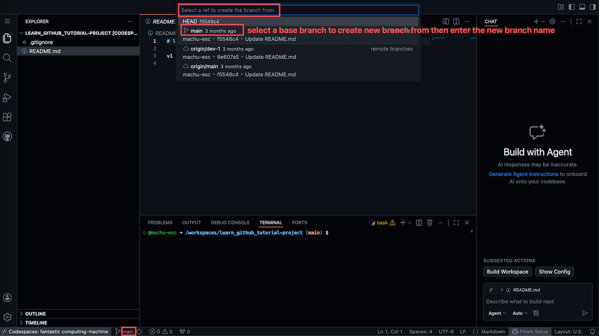

# 用分支和 Pull Request 完成一次改动

## 1. 概览

上一篇你学会了把改动 commit 并 push 到 GitHub. 但那时候你是直接在 `main` 分支上改的, 而在真实项目里, 几乎没有人会这么做.

原因很简单: `main` 是项目的正式版本, 是所有人共同依赖的那一份代码. 你在上面直接改, 万一改坏了, 所有人立刻受影响. 通行的做法是先从 `main` 拉出一个属于自己的分支, 在这个分支上随便折腾, 做好了再通过 Pull Request 请求把改动合并回 `main`, 合并之前别人还有机会看一眼. 这个流程听起来正式, 其实每一步在 Codespaces 里都是点几下的事情.

这一篇带你完整走一遍.

---

## 2. 学习目标

学完这个 mini task, 你将能够:

1. 说清楚为什么真实项目里不直接在 `main` 分支上改代码
2. 在 Codespaces 里基于指定的分支创建一个新分支
3. 把新分支推送到 GitHub, 并理解本地创建不等于远程已经存在
4. 在 GitHub 上开一个 Pull Request 并把它合并回 `main`
5. 独立走完一次从创建分支到合并的完整闭环

---

## 3. 前置知识

- 会在 Codespaces 里完成 stage, commit, push

---

## 4. 你将构建或学到什么

你会走完一次真实的分支协作流程: 创建自己的工作分支, 修改一个文件, 提交并推送到 GitHub, 再开一个 Pull Request 并把它合并回 `main`, 最终得到一个可以拿给别人看的, 已经成功合并的 PR 链接.

---

## 5. 创建你的工作分支

所有分支操作的入口都在同一个地方: 界面左下角状态栏上的分支名. 现在那里显示的应该是 `main`, 点它一下.

顶部会弹出一个列表. 列表下半部分是已有的分支, 点谁就切到谁; 上半部分是我们现在要用的创建选项. 那里有两个看起来很像的条目, 建议你一律用第二个:

Create new branch... 会直接问你新分支叫什么, 至于基于哪个分支, 它默认用你当前所在的那个. Create new branch from... 会先让你挑一个基础分支, 然后才问名字. 多一步, 但你确切知道自己在基于什么开工.

点击 Create new branch from... 之后, 会出现这样一个列表:

这里选 `main`, 因为你想基于项目当前的正式版本开始. 选完之后顶部输入框会让你填新分支的名字, 比如 `feature-update-readme`, 回车确认.

名字随便起是可以的, 但让别人一眼看懂会更好: `feature-` 开头表示新功能, `fix-` 开头表示修问题, 也有人用自己的名字加 `-dev` 做个人开发分支. 尽量避开 `test`, `branch1` 这种过两天自己都想不起来是什么的名字.

创建完成后你会自动切换过去, 左下角的分支名从 `main` 变成了新分支. 从这一刻起, 你做的任何改动都不会影响 `main`.

顺带一提, 如果你手上正好有还没 commit 的改动, 切换分支时可能会弹出一个对话框问你怎么处理. 现在先保持工作区干净再来做这个练习, 那个对话框和它的三个选项, 下一篇会专门讲.

---

## 6. 在分支上修改并提交

接下来这一段你在上一篇已经做过了, 流程一模一样, 唯一的区别是现在你不在 `main` 上.

打开 `README.md` 或者任意一个文件, 改点东西, 保存. 打开源代码管理面板, 点文件旁边的 `+` 把改动 stage 起来, 在 Message 框里写一条说明这次改了什么的消息, 点击 Commit.

到这里, 改动被记录进了本地的 Git 历史, 但它还在你的 Codespace 里, GitHub 上什么都看不到.

---

## 7. 把分支推送到 GitHub

这里有一件容易被忽略的事情: 你刚才创建的分支, 此刻只存在于你的 Codespace 里. GitHub 上根本不知道有这么一个分支存在.

点击 Sync Changes 按钮, 或者状态栏上分支名旁边的同步图标. 因为这是一个 GitHub 还没见过的新分支, 界面可能会问你要不要发布它, 或者按钮直接显示成 Publish Branch, 点确认即可.

推送完成后, 去 GitHub 上打开这个仓库, 在分支下拉框里就能看到你的新分支了. 到这一步, 分支和上面的提交才算真正对外存在.

---

## 8. 开一个 Pull Request 并合并

现在分支在 GitHub 上了, 但 `main` 还是老样子. 要让改动进入 `main`, 得开一个 Pull Request.

刚 push 完就打开仓库首页的话, 页面顶部通常会出现一条黄色提示, 大意是你的某个分支刚有新的推送, 旁边有一个 Compare & pull request 按钮, 点它最省事. 如果没等到这条提示也不要紧, 进入仓库的 Pull requests 标签页, 点 New pull request, 手动选择从你的分支合并到 `main` 就行.

接下来填写标题和描述. 标题写清楚这次改了什么, 描述可以说明为什么要改. 在真实项目里这段描述就是给审查你代码的人看的, 写得越清楚, 别人看得越快. 填好后点击 Create pull request.

PR 创建出来之后, 页面上会把这次改动逐行列出来, 红色是删掉的, 绿色是新增的, 和你在编辑器里看到的 diff 是一回事. 确认没问题, 点击 Merge pull request, 再确认一次, 合并就完成了. 按钮会变成不可点击的已合并状态, `main` 现在包含了你的改动.

这就是一次完整的闭环. 值得留意的是, 整个过程你一条 Git 命令都没敲, 但走的正是专业团队每天在做的那套流程.

---

## 9. 合并之后还有两件小事

合并完成后, GitHub 通常会在页面上给出一个 Delete branch 按钮. 这个分支的使命已经完成了, 删掉能让仓库的分支列表保持干净. 删的只是 GitHub 上的远程分支, 提交记录已经在 `main` 里了, 不会丢.

另外记得回到 Codespace, 切换到 `main` 并同步一次. 因为合并是在 GitHub 那边发生的, 你本地的 `main` 还停留在合并之前. 不同步就直接开下一个分支, 你会基于一份过时的 `main` 开工.

---

## 10. 练习

目标: 独立完成一次从创建分支到 PR 合并的完整闭环, 并拿到一个已合并的 PR 链接.

怎么做:

1. 在你自己的一个仓库里打开 Codespace.
2. 用 Create new branch from... 基于 `main` 创建一个新分支.
3. 修改一个文件并保存.
4. 依次完成 stage 和 commit, 写一条说得清楚的 commit 消息.
5. push 到 GitHub, 如果提示要发布分支就点确认.
6. 在 GitHub 上开一个 Pull Request, 检查改动无误后合并.
7. 合并后删掉这个分支, 再回到 Codespace 把 `main` 同步一下.

你会观察到: 分支从只存在于本地, 到 push 之后出现在 GitHub 的分支列表里; PR 页面把你的改动逐行展示出来; 合并之后按钮变成不可点击的已合并状态, 而 `main` 的内容随之更新.

关键洞见: 分支的价值在于隔离. 在分支上你可以放心大胆地试错, 因为无论怎么折腾, `main` 始终是那个随时可用的版本. Pull Request 则是把这份隔离重新汇合回去的正式通道, 顺便给了别人一个看一眼的机会.

---

## 11. 回顾

- 真实项目不在 `main` 上直接改, 而是拉一个分支, 做完再通过 PR 合并回去.
- 状态栏的分支名是所有分支操作的入口, 推荐用 Create new branch from... 明确指定基础分支.
- 新建的分支只存在于本地, push 之后才会出现在 GitHub 上.
- Pull Request 是请求把分支合并进 `main` 的正式通道, 它同时提供了一个逐行审查改动的页面.
- 合并之后删掉用完的分支, 并把本地的 `main` 同步到最新.

---

## 12. 导师寄语

走到这里, Git 版本控制的核心工作流你已经全部走过一遍了: commit 记录改动, push 发布出去, branch 隔离你的工作, Pull Request 把工作正式汇合回主线. 一条命令没学, 但这套流程本身才是重点, 命令只是它的一种表达方式.

有一件事值得单独说一说, 就是 Pull Request 里 "Request" 这个词. 它不是技术上的必需品, 你完全可以在本地把分支合进 `main` 然后推上去, 结果一模一样. PR 之所以存在, 是因为它把合并这件事变成了一个可以讨论的过程: 有一个页面能逐行看改动, 有地方留言提意见, 有记录说明这次合并是谁批准的. 换句话说, PR 解决的是协作问题, 不是技术问题. 这也是为什么几乎所有团队都强制走 PR, 哪怕只有两个人.

对你自己的项目, 我的建议是即使单打独斗也养成用分支加 PR 的习惯. 好处不只是流程正规, 而是 `main` 会一直保持在一个能用的状态, 你的任何实验搞砸了都不会波及它. 这份安全感会让你更敢试.

至于以后遇到搞不定的情况, 有个很实用的办法: 把错误信息截图或复制下来问 AI, 然后在 Codespace 里试它给的命令. 反正是云端环境, 而且只要没 push, 所有改动都还在本地, 大不了删掉重来.
