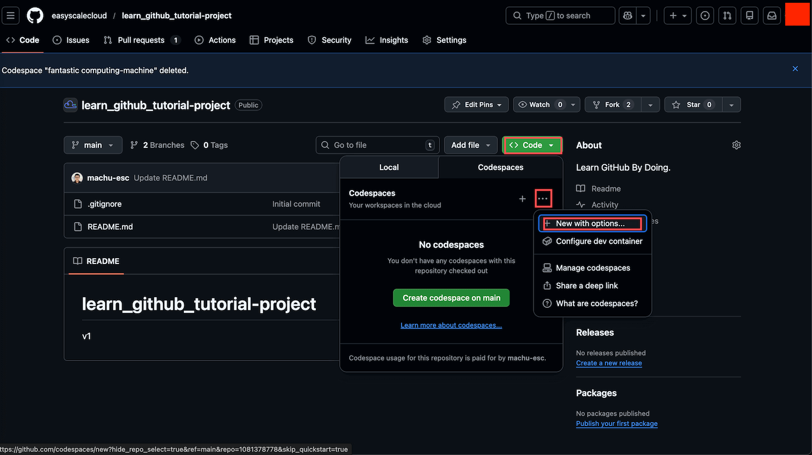

# GitHub Codespaces: 费用, 管理与最佳实践

> 一句话说明这个 mini task 教什么: 看懂 Codespaces 怎么计费, 学会该 Stop 还是该 Delete, 养成几条省钱又省心的使用习惯.

## 1. 概览

前面几个 mini task 你已经学会了创建 Codespace, 修改代码, 提交推送, 创建分支, 用 PR 合并改动. 这些是操作层面的技能. 这篇要补上另一半, 也是很多初学者会忽略的一半: 这东西到底怎么计费, 我该怎么管理它才不会既浪费额度, 又不小心丢代码.

---

## 2. 学习目标

Codespaces 是一种典型的云服务, 它不是你买断的电脑, 而是按需租用的计算资源. 不理解计费逻辑, 你要么会因为不敢用而错过它的方便, 要么会因为用错方式白白浪费免费额度, 甚至在超出额度后收到意外账单. 更重要的是, 这套计费逻辑不是 Codespaces 独有的, 你以后接触 AWS, Azure, Google Cloud 等任何云平台, 都会用到同一套思维方式.

学完这个 mini task, 你将能够:

1. 判断 GitHub 免费账户的 compute 和 storage 额度, 对自己的学习和个人项目来说是否够用
2. 区分 compute 和 storage 两种独立账单, 分别在什么时候触发计费
3. 根据场景选择 Stop 还是 Delete, 并养成删除前先确认代码已经 push 的习惯
4. 理解 Codespaces 30 天无操作自动删除的默认行为, 以及它对未推送代码的风险
5. 掌握几条可以立刻落地的省钱习惯, 并把这套思维方式迁移到其他云服务

---

## 3. 前置知识

- 完成过前面的 mini task, 会创建, 修改, 提交并推送 Codespace 里的代码
- 有一个 GitHub 账户, 且至少用过一次 Codespaces

---

## 4. 你将构建或学到什么

这是一篇纯阅读型的 mini task, 你不会在这里写代码或搭建项目, 而是建立一套完整的 Codespaces 计费心智模型: 免费额度有多少, compute 和 storage 分别怎么算钱, Stop 和 Delete 该怎么选, 以及一套能立刻用起来的省钱习惯清单. 读完之后, 你面对自己的 Codespaces 列表, 应该能一眼判断哪些该留, 哪些该关, 哪些该删.

---

## 5. 免费额度: 够用吗

根据 [GitHub 官方计费文档](https://docs.github.com/en/billing/concepts/product-billing/github-codespaces), 个人账户每月的免费额度如下:

| 账户类型 | compute (每月) | storage (每月) |
| :--- | :--- | :--- |
| GitHub Free | 120 小时 | 15 GB-month |
| GitHub Pro | 180 小时 | 20 GB-month |

这些数字来自官方文档, 但 GitHub 有可能调整政策, 值得偶尔回去 [官方计费页面](https://docs.github.com/en/billing/concepts/product-billing/github-codespaces) 确认一次.

这里的 "小时" 是以最低配置 (2-core) 机器为基准的. 换成更高配置, 消耗速度会按比例放大:

| 机器配置 | 1 小时实际消耗的额度 |
| :--- | :--- |
| 2-core | 1 小时 |
| 4-core | 2 小时 |
| 8-core | 4 小时 |
| 16-core | 8 小时 |

也就是说, 只要你用的是 2-core 机器, Free 账户每月能用 120 小时. 换成 4-core, 有效时间就只剩 60 小时.

对学习和个人项目来说, 120 小时通常是够用的: 每天用 4 小时, 能撑满一整个 30 天的月份; 每周用 20 小时, 能撑 6 周. 但一旦换成更大的机器, 这些额度会消耗得快很多.

创建 Codespace 时, 默认会直接给你一个标准配置的环境, 但你可以主动选择更低的配置来省额度. 在任意 repository 页面点击绿色的 Code 按钮, 切换到 Codespaces 标签页:

- 直接点击 Create codespace on main, 会使用默认机器配置
- 点击旁边的 ..., 选择 New with options..., 可以自己挑

在 New with options... 里, 你可以设置:

- Branch: 从哪个分支创建
- Region: 服务器区域, 选离自己近的延迟更低
- Machine type: 机器配置, 没有特殊需求就选 2-core / 8GB RAM

对学习和日常开发来说, 2-core 配置完全够用, 只有跑大型构建或机器学习负载时才需要更高配置.

---

## 6. compute 与 storage: 两笔独立的账单

这是很多刚接触云服务的人容易搞混的地方: Codespaces 的费用其实是两件完全独立的事情.

compute 按运行时间收费: Codespace 处于运行状态时才计费, 一旦 Stop 就不再产生 compute 费用. 单位是小时, 价格从 2-core 机器每小时 $0.18 起, 按机器配置成倍增加:

| 机器配置 | 每小时价格 |
| :--- | :--- |
| 2-core | $0.18 |
| 4-core | $0.36 |
| 8-core | $0.72 |
| 16-core | $1.44 |
| 32-core | $2.88 |

一句话总结: 开机就计费, 关机就停止计费.

storage 按占用空间收费: 只要 Codespace 还存在, 不管是运行中还是已停止, 都会占用 storage 额度, 只有 Delete 之后才不再计费. 单位是 GB-month, 价格是每 GB 每月 $0.07. 一句话总结: 只要没删, 就一直占着存储额度.

把两者放在一起看会更清楚:

| 状态 | compute 计费 | storage 计费 |
| :--- | :--- | :--- |
| 运行中 | 计费 | 计费 |
| 已 Stop | 不计费 | 计费 |
| 已 Delete | 不计费 | 不计费 |

---

## 7. Stop 与 Delete: 怎么选

这是管理 Codespaces 最核心的判断.

Stop 相当于把笔记本合上休眠: 硬盘上的所有东西原样保留, 明天打开还能接着做, 不产生 compute 费用, 但 storage 仍在计费. 适合今天的工作告一段落, 但短期内还会回到同一份代码上继续做的情况.

Delete 相当于把这台机器直接扔掉: 里面的一切都不复存在, 下次要重新创建一个全新的 Codespace, compute 和 storage 都不再计费. 适合这个任务已经彻底做完, 短期内不会再用到这个环境的情况.

在点 Delete 之前, 有一件事必须先确认: 代码已经 push 到 GitHub. 记住这个心智模型: push 过的代码活在 GitHub 服务器上, 不管 Codespace 发生什么都安全; 没 push 的代码只存在于这个 Codespace 内部, 一删就没了. 养成这个顺序: 做完工作, commit, push, 再决定是 Stop 还是 Delete.

也不用把 Codespace 当成需要小心翼翼保护的基础设施. 它本质上是可以随时丢弃重建的临时工作区, 只要代码已经 push, 删除旧的, 从同一个 repo 重新创建一个, 它会自动拉取最新代码, 几分钟内就能重新开工.

---

## 8. 自动删除: GitHub 帮你清理

GitHub 会自动删除长期闲置的 Codespace, 不需要你手动操心. 根据 [官方文档](https://docs.github.com/en/codespaces/setting-your-user-preferences/configuring-automatic-deletion-of-your-codespaces), 默认规则是: 一个 Codespace 连续 30 天无操作会被自动删除, 删除前 24 小时会发邮件提醒, 只要重新打开过一次, 计时器就会重置, 保留期限也可以在设置里调整, 范围是 0 到 30 天.

也就是说, 一个 Codespace 放着一个月不管, GitHub 会替你把它清掉, 这其实是件好事, 能自动帮你控制 storage 占用. 唯一的风险在于, 如果里面还留着没有 push 的代码, 这些代码也会一起消失, 这再次说明了 push 习惯的重要性.

---

## 9. 最佳实践: 省钱省心的习惯

把前面几节的知识落成几条日常习惯, 长期坚持下来能省下不少额度:

1. 用完就 Stop: 不用的 Codespace 不要一直挂着运行. 可以在 Codespace 界面左下角点击 Codespaces: xxx, 选择 Stop Current Codespace; 也可以直接关掉浏览器标签页, Codespaces 会在 30 分钟无操作后自动 Stop.
2. 用够用的最小机器: 除非确实需要跑 CPU 密集型任务, 否则一律选 2-core. 这项习惯长期下来能让免费额度撑得久很多.
3. 早 push, 常 push: 每完成一个阶段的工作就 commit 加 push, 哪怕是实验性的代码, 也先推到一个分支上. 一个可行的工作流是: 新建一个分支 (比如 experiment-xxx), 在这个分支上随意折腾, 每隔一段时间 commit 加 push, 实验成功就开 PR 合并到 main, 失败就直接删掉这个分支.
4. 定期清理不用的 Codespaces: 打开 [github.com/codespaces](https://github.com/codespaces), 看看自己名下都有哪些正在运行或已停止的 Codespaces, 把不再需要的删掉, 不要让闲置环境一直占着 storage 额度.
5. 就算是自己单干, 也用分支加 PR: 独自开发时很容易图省事直接在 main 上改. 更好的习惯是所有改动都在分支上进行, 通过 PR 合并回 main, 让 main 始终保持干净可用的状态. 这样即使某次实验搞砸了, main 依然稳定, 随时可以回退.

---

## 10. 练习

下面几个练习分别对应上面讲过的知识点, 建议对着自己真实的 Codespaces 账户逐条动手做一遍.

### 练习 1: 盘点你的 Codespaces 使用情况

**目标:** 摸清自己当前有多少个 Codespaces, 分别在运行还是已停止, 用的是什么机器配置.

**怎么做:**

1. 打开 [github.com/codespaces](https://github.com/codespaces), 浏览完整列表.
2. 记录哪些处于 Running 状态, 哪些是 Stopped.
3. 点开任意一个的 ... 菜单, 查看它的 machine type, 判断是不是 2-core.

**你会观察到:** 大概率会发现有些 Codespaces 一直停留在创建时的默认配置, 也可能有一些早就用不上却还留在列表里, 悄悄占用 storage 额度.

> **关键洞见:** 光是定期看一眼自己有什么, 就足以发现浪费. 巡查是省钱的第一步.

### 练习 2: 练习 Stop 和 Delete 的取舍

**目标:** 亲手走一遍 Stop 和 Delete 的操作路径, 并在删除前完成 push 确认.

**怎么做:**

1. 如果有一个正在运行的 Codespace, 用左下角状态栏菜单或 dashboard 把它 Stop.
2. 找一个确认不再需要, 且代码已经 push 过的 Codespace, 用 dashboard 里的 Delete 删除它.
3. 删除前务必再确认一次: 检查 git 状态或 GitHub 网页上的代码, 确保没有遗漏的改动.

**你会观察到:** Stop 之后的 Codespace 仍然出现在列表里 (继续占用 storage), Delete 之后则会彻底从列表消失.

> **关键洞见:** Stop 和 Delete 不是同一个动作的两种叫法, 而是两种完全不同的计费状态, 选错了要么多花钱, 要么丢代码.

### 练习 3: 用 New with options 创建一个省钱的 Codespace

**目标:** 练习手动指定机器配置, 养成默认选最小机器的习惯.

**怎么做:**

1. 在任意 repo 页面点击绿色的 Code 按钮, 切到 Codespaces 标签页.
2. 点击 ..., 选择 New with options....
3. 把 Machine type 选成 2-core / 8GB RAM, Region 选离自己近的.

**你会观察到:** 除非任务是跑大型构建或机器学习负载, 2-core 配置足以应付日常学习和开发.

> **关键洞见:** 免费额度是按最小机器换算出来的, 用更大的机器本质上是在更快地燃烧这份额度.

---

## 11. 回顾: 我们学到了什么

- 免费额度: Free 账户每月 120 compute 小时加 15GB storage, 以 2-core 机器为基准计算.
- 两种账单: compute 只在运行时计费, storage 只要 Codespace 存在就一直计费.
- Stop 与 Delete: Stop 是暂停, 还占 storage; Delete 是彻底清空, 什么都不再计费; 删除前一定要先 push.
- 自动清理: GitHub 会在 30 天无操作后自动删除 Codespace, 只要代码已经 push 就不必担心.
- 省钱习惯: 用完就 Stop, 用够用的最小机器, 频繁 push, 定期清理, 始终用分支加 PR.

---

## 12. 导师寄语

**为什么这个练习重要:**

搞懂 Codespaces 的计费方式, 你其实是在学一件更通用的事情: 按需计费 (pay-as-you-go) 的云服务定价模型是怎么运作的. 老式的模式是买一台电脑, 一次性付钱, 不管用不用都是你的; 按需计费的模式是你租用计算资源, 用多少付多少, 不用就不花钱. 这个转变听起来简单, 但它是理解几乎所有现代云平台账单的起点.

**关键洞见:**

- 几乎所有云服务都会围绕三个维度收费: compute (CPU 和内存的使用, 在 Codespaces 里体现为 core-hours), storage (磁盘空间的占用, 体现为 GB-month), 以及 network (数据传输量, Codespaces 目前免费包含). 不同产品可能只对其中一两项收费, 但这个框架在整个行业里是通用的.
- 换到 AWS, Azure, Google Cloud 或任何其他云平台, 同样的三个问题依然适用: 这个服务的计费单位是什么? 什么操作会触发扣费? 哪里是省钱的容易入手点?

**下一步:**

把这套思维方式当成一个可以随身携带的检查清单. 以后每接触一个新的云服务, 先问一遍这三个问题, 你会发现看懂任何一份陌生的账单都会快很多.

---

## 13. 速查

**账单速查:** compute 按运行小时数计费 (2-core 起价 $0.18/ 小时), storage 按 GB-month 计费 ($0.07/GB/ 月), Stop 只省 compute, Delete 才两者都省.

**关键链接:**

- [GitHub Codespaces 计费说明](https://docs.github.com/billing/managing-billing-for-github-codespaces/about-billing-for-github-codespaces)
- [配置 Codespaces 自动删除](https://docs.github.com/en/codespaces/setting-your-user-preferences/configuring-automatic-deletion-of-your-codespaces)
- [GitHub 定价页面](https://github.com/pricing)
- [Codespaces 管理面板](https://github.com/codespaces)
